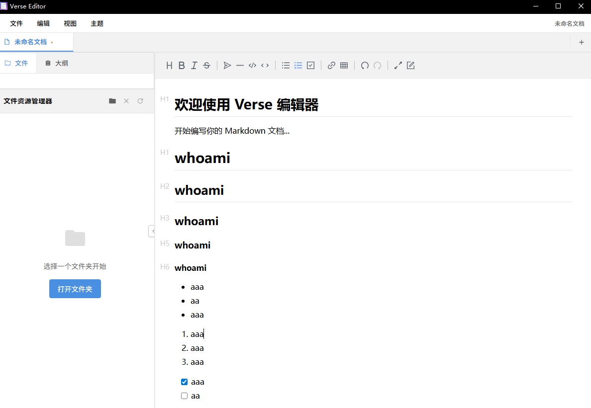
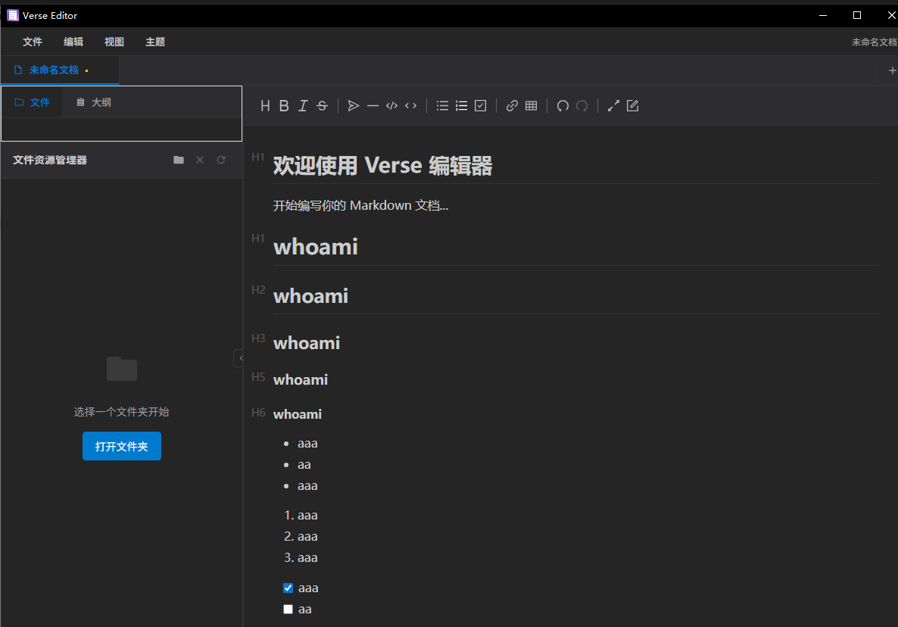

# Verse Editor

一个基于 Tauri 和 Vditor 的现代化 Markdown 编辑器，类似 Typora 的所见即所得体验。

浅色模式：


深色模式：


## 功能特性

- 🎨 **所见即所得编辑** - 支持三种编辑模式：
  - WYSIWYG（所见即所得）
  - IR（即时渲染，类似 Typora）
  - SV（分屏预览），可一键复制微信公众号、知乎等格式，方便发文章~
- 🗂️ **智能大纲导航**
  - 自动解析文档结构
  - 基于 Markdown 标题的层次大纲
  - 快速跳转到指定章节
  - 支持折叠/展开章节
- 🎯 **现代化界面**
  - 类似 Typora/Obsidian 的布局
  - 可调整的侧边栏
  - 响应式设计
  - 支持深色模式
  - 直观的工具栏
- ⚡ **高性能**
  - 基于 Tauri 的轻量级桌面应用，程序编译后，安装包3M以内，安装后占用磁盘空间11M左右
  - Rust 后端，Vue 3 前端
  - 原生性能体验

## 技术栈

- **前端**: Vue 3 + Vite
- **编辑器**: [Vditor](https://github.com/Vanessa219/vditor) - 强大的 Markdown 编辑器
- **桌面框架**: Tauri 2.0
- **后端**: Rust
- **构建工具**: Vite

## 开发环境配置

### 前置要求

1. **Node.js** (推荐 LTS 版本)
2. **Rust** (最新稳定版)
3. **系统依赖**:
   - Windows: Microsoft C++ Build Tools
   - macOS: Xcode Command Line Tools
   - Linux: 参考 [Tauri 官方文档](https://tauri.app/v1/guides/getting-started/prerequisites)

### 安装依赖

```bash
# 安装前端依赖
npm install

# 安装 Tauri CLI (如果尚未安装)
npm install -g @tauri-apps/cli
```

### 开发模式

```bash
# 启动开发服务器
npm run tauri:dev
```

### 构建应用

```bash
# 构建生产版本
npm run tauri:build
```

## 贡献

欢迎提交 Issue 和 Pull Request！

## 许可证

GPL3.0 License

## 鸣谢

- [Vditor](https://github.com/Vanessa219/vditor) - 优秀的 Markdown 编辑器
- [Tauri](https://tauri.app/) - 现代化的桌面应用框架
- [Vue.js](https://vuejs.org/) - 渐进式 JavaScript 框架